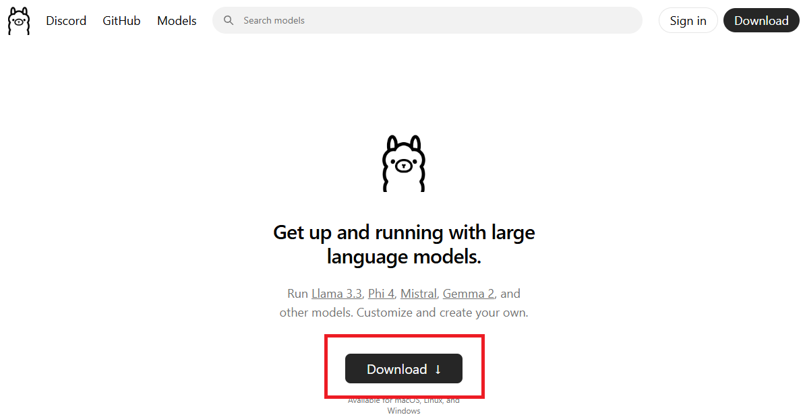
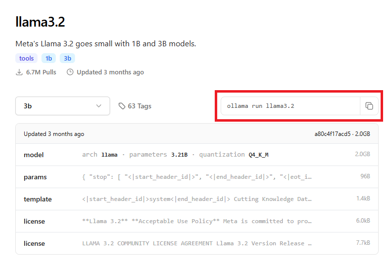

# Erstinstallation Askl-AI-on

Eine lokale KI zum Laufen zu bringen ist erstaunlich einfach, ein paar Installationsschritte sehen evtl. etwas gruselig aus für Leute, die noch nie das Terminal benutzt haben, aber wir versprechen, es ist überhaupt nicht so schlimm.

## Installation Ollama

Ollama ist das Herzstück der lokalen KI und läuft im Hintergrund. Auf [www.ollama.com](https://ollama.com/) einfach auf Download klicken, das jeweilige Betriebssystem auswählen und wie gewohnt dem Installationsprozess folgen.

## Das Modell herunterladen und starten

Ollama ist nur das Grundgerüst und selbst noch keine KI. Man muss sich jetzt ein sogenanntes LLM (large language model) herunterladen, mit dem dann die eigentliche Interaktion stattfinden. Auf der Ollama-Website klickt man auf den Reiter "Models".

Am Besten ist für den Anfang ein kleines Modell geeignet, das läuft auf schwachen Rechnern auch deutlich flüssiger. Die Größe eines Modells wird in Milliarden von Parametern (B) angegeben. Größere Modelle sind leistungsstärker, benötigen aber auch mehr Rechenressourcen.

- Kleine Modelle (1B - 3B): Diese Modelle sind ideal für Geräte mit geringerer Rechenleistung, wie z.B. ältere Rechner oder Smartphones. Sie bieten eine solide Leistung und sind die beste Wahl, wenn du schnelle Ergebnisse bei geringeren Anforderungen erzielen möchtest. Diese Modelle sind in der Regel die schnellsten und ressourcenschonendsten.
- Mittelgroße Modelle (7B - 14B): Diese Modelle sind für durchschnittlich leistungsstarke Computer geeignet, insbesondere für Rechner mit moderner Grafikkarte (GPU). Sie bieten eine gute Balance zwischen Leistung und Ressourcenverbrauch und sind gut geeignet für die meisten Anwendungen.
- Große Modelle (20B - 30B): Diese Modelle bieten eine hohe Leistung und sind am besten für sehr leistungsfähige Maschinen mit guter GPU geeignet. Sie liefern die detailliertesten und präzisesten Ergebnisse, können jedoch nur auf High-End-Systemen flüssig laufen.
- Sehr große Modelle (größer als 30B): Diese Modelle sind für spezialisierte, hochleistungsfähige Server oder Cloud-Dienste gedacht. Sie erfordern enorm viel Rechenleistung und sind für die meisten Benutzer nicht praktikabel.

Aber wie gesagt, zum Start fangen wir klein an, z.B. mit llama3.2 in der 3B Variante. Hierzu einfach llama3.2 aus der Liste auswählen oder auf [www.ollama.com/library/llama3.2](https://ollama.com/library/llama3.2) klicken.

Man kommt jetzt auf die Seite des Models, hier gibt es viele Informationen, die uns aktuell nicht interessieren. Das einzige relevante ist dieser Kasten:

Diesen Text kann man einfach markieren und mir STRG + C kopieren, oder man klickt das kleine Symbol rechts.

Jetzt kommt der Schritt, der eventuell etwas gruselig ist. Man öffnet die sogenannte Eingabeaufforderung (oder bei Macs das Terminal). Die Eingabeaufforderung (bei Windows) oder das Terminal (bei Macs) ist ein Programm, in dem man Befehle direkt in Textform eingibt, um deinem Computer Aufgaben zu geben. Es sieht zwar ein bisschen wie im Film "Die Matrix" aus, ist aber ganz einfach. Und das geht folgendermaßen:
1. Windowstaste drücken
2. Den Text "cmd" eingeben (ohne Anführungszeichen) und Enter drücken. Bei Macs statt dessen die Terminal-App starten.
3. Jetzt den kopierten Text `ollama run llama3.2` von der Ollama-Website einfach mit STRG + V einfügen. 

Wenn man jetzt ENTER drückt, wird das ausgewählte Modell heruntergeladen.

Und schon ist man essentiell fertig, man kann direkt mit dem LLM reden. Versuchen Sie doch einfach einmal eine Frage zu stellen.

Natürlich ist diese Art der Interaktion mit dem LLM umständlich und ungewohnt, aber jetzt wissen wir, dass es läuft und können uns jetzt im 2. Schritt um eine angenehmere Benutzeroberfläche kümmern wie z.B. [Openweb UI](https://github.com/open-webui/open-webui).