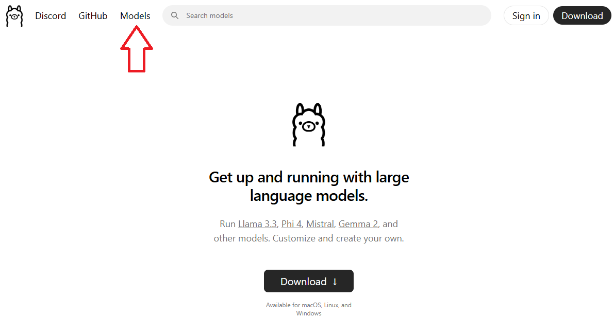
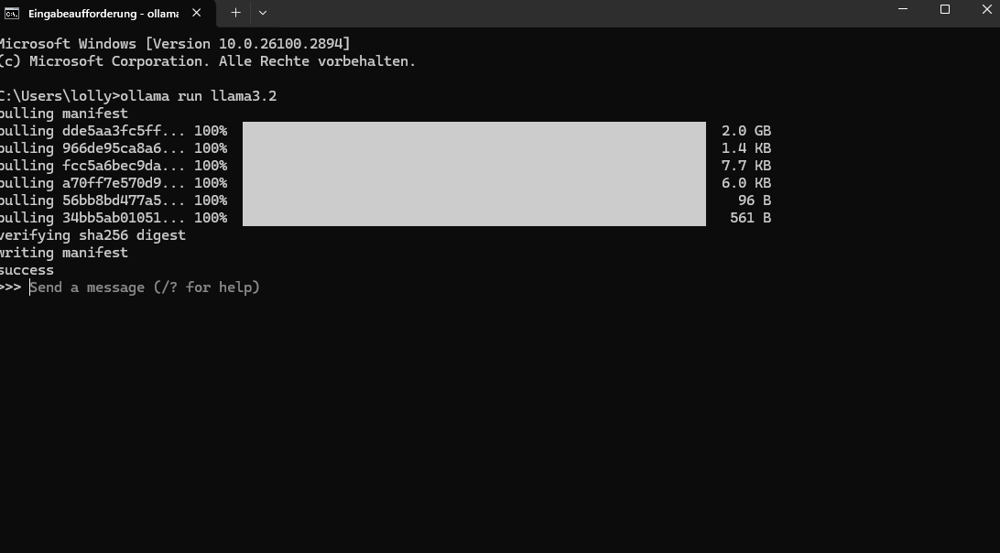

# Erstinstallation Askl-AI-on

Eine lokale KI zum Laufen zu bringen ist erstaunlich einfach, ein paar Installationsschritte sehen evtl. etwas gruselig aus für Leute, die noch nie das Terminal benutzt haben, aber wir versprechen, es ist überhaupt nicht so schlimm.

## Installation Ollama

Ollama ist das Herzstück der lokalen KI und läuft im Hintergrund. Auf [www.ollama.com](https://ollama.com/) einfach auf Download klicken, das jeweilige Betriebssystem auswählen und wie gewohnt dem Installationsprozess folgen.

## Das Modell herunterladen und starten

Ollama ist nur das Grundgerüst und selbst noch keine KI. Man muss sich jetzt ein sogenanntes LLM (large language model) herunterladen, mit dem dann die eigentliche Interaktion stattfinden. Auf der Ollama-Website klickt man auf den Reiter "Models".

Am Besten ist für den Anfang ein kleines Modell geeignet, das läuft auf schwachen Rechnern auch deutlich flüssiger. Die Größe des Modells erkennt man an der B-Zahl. 1B-3B sind z.B. sehr kleine Modelle die sogar auf Handys funktionieren würden, 7B-14B mittelgroße Modelle, die auf Rechnern mit einer relativ neuen Grafikkarte laufen, 20B-30B-Modelle laufen nur auf sehr guten Grafikkarten flüssig. Noch größere Modelle sind - zumindest für unsere Zwecke - unpraktikabel, da sie sehr teure Server benötigen. Aber wie gesagt, zum Start fangen wir klein an, z.B. mit llama3.2 in der 3B Variante. Hierzu einfach llama3.2 aus der Liste auswählen oder auf [www.ollama.com/library/llama3.2](https://ollama.com/library/llama3.2) klicken.

Man kommt jetzt auf die Seite des Models, hier gibt es viele Informationen, die uns aktuell nicht interessieren. Das einzige relevante ist dieser Kasten:

Diesen Text kann man einfach markieren und mir STRG + C kopieren, oder man klickt das kleine Symbol rechts.

Jetzt kommt der Schritt, der eventuell etwas gruselig ist. Man öffnet die sogenannte Eingabeaufforderung (oder bei Macs das Terminal). Und das geht folgendermaßen
1. Windowstaste drücken
2. Den Text "cmd" eingeben (ohne Anführungszeichen). Bei Macs statt dessen die Terminal-App starten
3. JEtzt den kopierten Text von der Ollama-Website einfach mit STRG + V einfügen.

Wenn man jetzt ENTER drückt, wird das ausgewählte Modell heruntergeladen.

Und schon ist man essentiell fertig, man kann direkt mit dem LLM reden. Versuchen Sie doch einfach einmal eine Frage zu stellen.

Natürlich ist diese Art der Interaktion mit dem LLM umständlich und ungewohnt, aber jetzt wissen wir, dass es läuft und können uns jetzt um eine angenehmere Benutzeroberfläche kümmern.