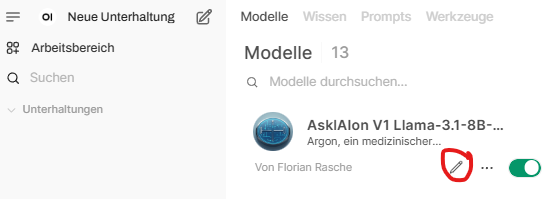

# Promptempfehlungen

In dieser Unterkategorie finden Sie Beispielprompts geordnet nach PVS-Systemen, die Sie im ausgewählten Modell als Systemprompt hinterlegen können, um eine möglichst passende Ausgabe zu erhalten. Verbesserungsvorschläge sind immer gerne willkommen.

## Eintragung als Systemprompt

Zunächst muss der Arbeitsbereich ausgewählt werden

Danach auf "Bearbeiten" beim genutzten Modell klicken

Den entsprechenden Systemprompt in das passende Feld kopieren

Wichtig ist, die Kontextlänge anzupassen (siehe Video), da sonst evtl. Teile des Transkriptes nicht beachtet werden. 7000 Token als Richtgröße haben sich bewährt.
Nicht vergessen, auf "Aktualisieren" zu klicken, sonst wird die Änderung nicht übernommen.

Und schon ist man fertig. Wenn man jetzt eine neue "Unterhaltung" startet mit dem angepassten Modell ist die Anweisung (der Prompt) automatisch hinterlegt und wird bei jedem Mal durchgeführt.