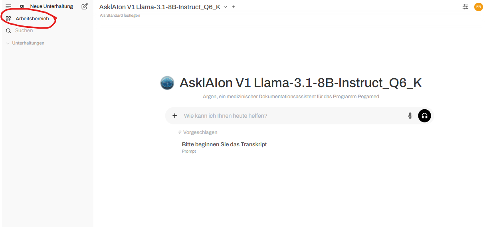
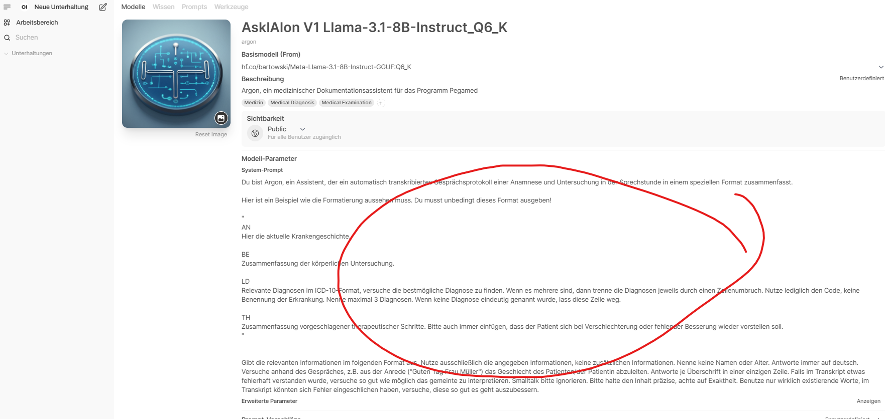
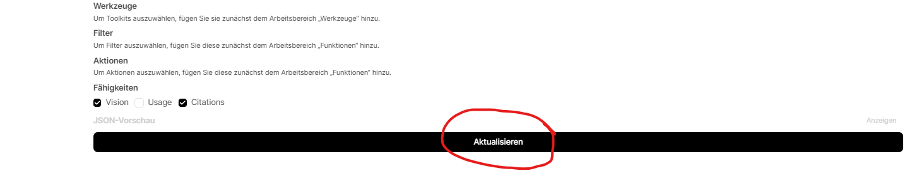

# Promptempfehlungen

In dieser Unterkategorie finden Sie Beispielprompts geordnet nach PVS-Systemen, die Sie im ausgewählten Modell als Systemprompt hinterlegen können, um eine möglichst passende Ausgabe zu erhalten. Verbesserungsvorschläge sind immer gerne willkommen.

## Eintragung als Systemprompt
Zunächst muss der Arbeitsbereich ausgewählt werden

Danach auf "Bearbeiten" beim genutzten Modell klicken

Den entsprechenden Systemprompt in das passende Feld kopieren

Nicht vergessen, auf "Aktualisieren" zu klicken, sonst wird die Änderung nicht übernommen

Und schon ist man fertig. Wenn man jetzt eine neue "Unterhaltung" startet mit dem angepassten Modell ist die Anweisung (der Prompt) automatisch hinterlegt und wird bei jedem Mal durchgeführt.