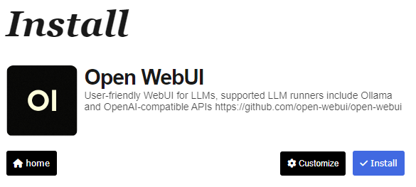

#Installation Openweb UI

Nachdem im ersten Schritt Ollama und ein Modell installiert wurde, folgt jetzt die Installation eines sogenannten Front-Ends, also eines Programms, das dafür gedacht ist, dass normale Menschen damit interagieren können.

Es gibt eine einfachere und eine etwas kompliziertere Variante. Zum Ausprobieren daheim wird hier die leichte Variante erklärt, die etwas kompliziertere ist dann für die Praxis geeignet, da hier mehr und fortgeschrittenere Optionen bestehen.

## Videoanleitung

## Installation mit Pinokio

Auf der Website https://pinokio.computer/ wird Pinokio heruntergeladen und wie jedes normale Programm installiert und gestartet. pinokio.computer ist ein Program, die eine Sammlung von KI-Tools bietet, mit denen Nutzer verschiedene Aufgaben erledigen können, wie z.B. das Erstellen von Texten oder das Bearbeiten von Bildern, alles direkt im Browser. Es richtet sich an Leute, die ohne viel Aufwand mit Künstlicher Intelligenz arbeiten möchten.

Nachdem man Pinokio gestartet hat, bitte auf "Discover" klicken.

Hier kann man sich jetzt die ganzen KI-Programme, die sich ohne großen Aufwand lokal installieren, anschauen. Wir wollen Open WebUI, das entweder suchen oder im Suchfeld eingeben

Auf der nächsten Website auf "Download" klicken.

Damit Open WebUI funktioniert braucht man Ollama, das haben wir bereits im ersten Schritt installiert, daher können wir in diesem Fenster einfach auf "Done" klicken.

Hier "Install" klicken

Und los geht's. Das angezeigte sieht evtl etwas ungewohnt aus, einfach das Programm arbeiten lassen und warten bis es fertig ist. Das dauert ein bisschen, da im Hintergrund viele Unterprogramme u.Ä. installiert werden. Bitte nicht abbrechen.

Irgendwann sieht man dann nur noch "Connected" stehen in dem schwarzen Feld. Dann einfach links unten auf "Home" klicken.

In der jetzt angezeigten Übersicht auf den Pfeil ganz rechts klicken

Es startet jetzt Open WebUI- Wenn alles geladen ist erscheint links ein Knopf namens "Open Web UI" mit einer kleinen Rakete daneben. Wenn man ihn klickt öffnet sich Open Web UI im Browser (also z.B. Edge, Chrome, Firefox...) und los geht's.

